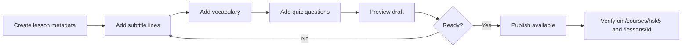

# Admin plan — Buunduu Surtsgaay (Phase 5)

This document plans **admin content management** and the lesson upload workflow before any admin UI is built.

**Phase 5 Step 1 — Completed (May 2026):** Planning, schema/policy design, and documentation only. No admin routes, forms, or user-facing UI changes.

---

## Why admin content management is needed

Today, lesson content lives in:

- **SQL seed files** under `supabase/seed/` (Lessons 1–4 in production DB)
- **Local TypeScript files** under `content/courses/hsk5/lessons/` (Lessons 1–3 fallback)

Adding or editing a lesson requires a developer to:

1. Write or edit large SQL `INSERT` blocks (subtitles, vocabulary, quiz rows)
2. Run scripts manually in the Supabase SQL Editor
3. Optionally mirror changes in local `.ts` files for fallback
4. Deploy nothing for DB-only lessons (Lesson 4), but still coordinate schema and counts

That works for early development but does not scale when:

- Non-developers (teachers, content editors) need to publish lessons
- Subtitles or quiz questions need quick fixes without a deploy
- Draft lessons should be previewed before learners see them

**Phase 5 goal:** Admins create and manage courses, lessons, subtitles, vocabulary, and quiz content through a protected admin UI, with Postgres RLS enforcing who can write.

---

## Current problem

| Issue | Impact |
|-------|--------|
| Content authored in SQL | High error risk; no validation UI; hard to reorder subtitles |
| No draft/publish split in app | `lessons.status` is `available` or `locked` today; no `draft` / `archived` in DB yet |
| No admin role in app | Any authenticated user is a learner only; content writes blocked only by missing policies |
| Dual source (Supabase + local) | Must keep fallback behavior; admin writes target Supabase only |

The learner app already loads content **Supabase-first** with **local fallback** ([lib/content.ts](./lib/content.ts)). Phase 5 adds **write paths for admins only**, without removing read fallback for guests.

---

## Future goal

- **Admin dashboard** (separate route prefix, e.g. `/admin`) for signed-in admins only
- **Forms and editors** for lesson metadata, subtitle lines, vocabulary, quiz questions
- **Preview** lesson as learners would see it (while status is `draft`)
- **Publish** sets lesson (and related visibility) to `available`
- **No code deploy** required to publish a new lesson when content is DB-only

User-facing routes (`/courses/hsk5`, `/lessons/[id]`, watch/vocabulary/quiz) stay unchanged; they simply respect published status when RLS and app filters align.

---

## Admin content workflow (planned)

High-level flow documented in detail in [CONTENT_WORKFLOW.md](./CONTENT_WORKFLOW.md):



1. Admin signs in with a normal Supabase account listed in `admin_profiles`.
2. Create lesson row (`draft`) under a course.
3. Add child rows: `subtitle_lines`, `vocabulary_words`, `quiz_questions`.
4. Preview (admin UI + optional learner-style preview route).
5. Publish → `lessons.status = 'available'` (and sync `vocabulary_count` / `quiz_count`).
6. Verify on public URLs; archive when retiring content.

---

## Security concerns

| Risk | Mitigation |
|------|------------|
| Anon key used for writes | Never add broad `INSERT` on content tables for `anon`; only `authenticated` + admin check |
| Service role in browser | **Never** expose `service_role` in Next.js client; admin UI uses anon key + user JWT + RLS |
| Privilege escalation | `admin_profiles` table; only admins manage admin list (after bootstrap) |
| Draft content leak | Public `SELECT` policies filter to `available` (and course catalog rules); admins get separate `SELECT` for all statuses |
| Progress tables | Unchanged — learners still only touch `user_*` tables with `auth.uid() = user_id` |
| Bootstrap first admin | First `admin_profiles` row inserted manually in SQL Editor (see [supabase/admin/README.md](./supabase/admin/README.md)) |

Admin checks in the app (Step 3+) will call Supabase to confirm `admin_profiles` exists for `auth.uid()` before showing `/admin`. Server-side checks should mirror RLS, not replace it.

---

## Admin access model (chosen: Option A)

**Option A — `admin_profiles` table** (selected for clarity):

```text
admin_profiles (
  user_id uuid primary key references auth.users(id),
  role text default 'admin',
  created_at timestamptz default now()
)
```

**Option B — user metadata** (deferred): possible later via `auth.users` raw app metadata, but harder to audit and query from RLS.

Planned SQL: [supabase/policies/002_admin_content_policies.sql](./supabase/policies/002_admin_content_policies.sql).

Helper pattern:

```sql
-- is_admin() when auth.uid() has a row in admin_profiles
exists (select 1 from public.admin_profiles where user_id = auth.uid())
```

---

## Relationship to Phase 4

| Layer | Phase 4 | Phase 5 |
|-------|---------|---------|
| Learner auth | Sign up / sign in | Unchanged |
| Progress RLS | `001_auth_rls_policies.sql` | Unchanged |
| Content RLS | Public read-only | Add admin write + status-filtered public read |
| App writes | Progress only | + Admin content CRUD (later steps) |

Apply **001** before production learner progress. Apply **002** only after admin UI and status migration are ready to test (Step 2+).

---

## Phase 5 roadmap

| Step | Focus | Status |
|------|--------|--------|
| 1 | Admin workflow planning (this doc, policies SQL, workflow docs) | ✅ Completed |
| 2 | Admin role model + RLS policy design / migration for `draft`·`archived` | Next |
| 3 | Admin dashboard shell (`/admin`, gate on `admin_profiles`) | Planned |
| 4 | Lesson create/edit form | Planned |
| 5 | Subtitle editor | Planned |
| 6 | Vocabulary editor | Planned |
| 7 | Quiz editor | Planned |
| 8 | Publish/unpublish workflow | Planned |
| 9 | Phase 5 final audit | Planned |

**Exit criteria (Phase 5):** New lesson published through admin UI without editing seed SQL or deploying app code.

---

## Related files

- [CONTENT_WORKFLOW.md](./CONTENT_WORKFLOW.md) — lesson upload steps and statuses
- [supabase/admin/README.md](./supabase/admin/README.md) — how to grant admin manually
- [supabase/policies/002_admin_content_policies.sql](./supabase/policies/002_admin_content_policies.sql) — planned RLS (do not auto-run)
- [DATABASE_SCHEMA.md](./DATABASE_SCHEMA.md) — Admin content management plan section
- [DEVELOPMENT_PLAN.md](./DEVELOPMENT_PLAN.md) — phase timeline
