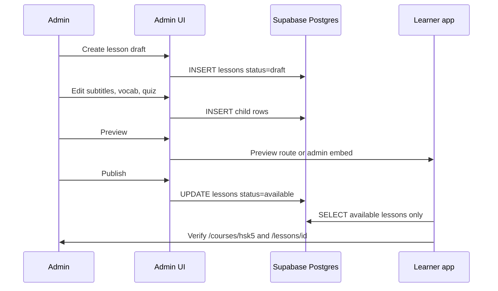

# Content workflow — lesson upload

Admins publish lessons through the Phase 5 admin UI. Public learners only see lessons with **`status = available`**.

**Preferred workflow:** Use **`/admin/lesson-builder`** for the guided draft → prompt → import → QA → **media** → preview → backup → publish checklist. See [LESSON_BUILDER_WORKFLOW.md](./LESSON_BUILDER_WORKFLOW.md).

**Media (Steps 15–16):** After QA, upload or attach lesson media before publishing. Upload via Supabase Storage on the edit page, or paste URLs manually. See [MEDIA_UPLOAD_WORKFLOW.md](./MEDIA_UPLOAD_WORKFLOW.md) and [MEDIA_WORKFLOW.md](./MEDIA_WORKFLOW.md).

---

## Content QA before publish

Admins should use **`/admin/lessons`** (Lesson Management QA dashboard) to verify each lesson before publishing:

| Check | QA rule |
|-------|---------|
| Metadata | Title, Chinese title, description, duration present |
| Subtitles | At least one timed subtitle line |
| Vocabulary | At least one word; count matches metadata `vocabulary_count` |
| Quiz | At least one question; count matches metadata `quiz_count` |

QA badge **Complete** means all checks pass. **Needs review** lists warnings (e.g. “No subtitles”, “Count mismatch”). Preview public routes from the QA table before setting `available`.

### Create draft metadata (Step 4)

Admins can create draft lesson metadata from **`/admin/lessons/new`** → **Save draft** → row in `lessons` with `vocabulary_count` / `quiz_count` = 0, default `status = draft`. Redirects to `/admin/lessons/{id}/edit`.

After draft creation, admins can **edit and save metadata** on **`/admin/lessons/{id}/edit`** before adding or importing content:

- Fields: title, chinese_title, subtitle, description, duration, status (`draft` / `available` / `archived`), order_index, vocabulary_count, quiz_count
- **Save metadata** — writes to Supabase via `updateLessonMetadata` (anon key + admin JWT + RLS)
- **Refresh counts** — syncs `vocabulary_count` / `quiz_count` from actual child rows
- Count mismatch warnings when metadata counts differ from DB row counts
- Status `available` shows a non-blocking warning if content is incomplete; stricter checks remain on **Publishing controls**

### Add content on edit page (Steps 5–7)

On **`/admin/lessons/{id}/edit`**:

1. **Subtitle editor** — add/delete `subtitle_lines` (start/end, chinese, pinyin, mongolian, order)
2. **Vocabulary editor** — add/delete `vocabulary_words` (HSK level, examples); updates `lessons.vocabulary_count`
3. **Quiz editor** — add/delete `quiz_questions` (options one per line); updates `lessons.quiz_count`
4. Use **Content QA** (`/admin/lessons`) to verify completeness before publish
5. **Preview** — available: `/lessons/{id}`; draft/archived: `/lessons/{id}?preview=admin` (admin only)
6. **Publishing controls** on edit page — Publish / Move to draft / Archive

### Publish / unpublish / archive (Step 8)

| Action | DB `lessons.status` | Public visibility |
|--------|----------------------|-------------------|
| Publish | `available` | Shown on `/courses/hsk5` and `/lessons/{id}` |
| Move to draft | `draft` | Hidden; admin preview only |
| Archive | `archived` | Hidden; admin preview only |

**Publish** requires metadata + at least one subtitle, vocabulary word, and quiz question. Draft and Archive do not.

Requires admin policies ([002_admin_content_policies.sql](./supabase/policies/002_admin_content_policies.sql)).

### Prompt generator + QA assistant (Step 10)

On **`/admin/lessons/{id}/edit`**:

1. **Import QA summary** — live checks (HSK distribution, duplicates, quiz mismatches, publish readiness).
2. **Lesson content prompt generator** — copy-ready ChatGPT prompt from lesson metadata.
3. **Bulk import** — validate (errors block, warnings allow) → import.

Workflow: **Create draft** → **Generate prompt** → **ChatGPT JSON** → **Validate** → **Import** → **QA** → **Preview** (`?preview=admin`) → **Publish**.

See [LESSON_PROMPT_TEMPLATE.md](./LESSON_PROMPT_TEMPLATE.md) and [LESSON_IMPORT_FORMAT.md](./LESSON_IMPORT_FORMAT.md).

### Bulk import from ChatGPT JSON (Step 9)

On **`/admin/lessons/{id}/edit`** → **Bulk import content**:

1. Paste JSON with `subtitles`, `vocabulary`, `quizQuestions` (aliases supported — see [LESSON_IMPORT_FORMAT.md](./LESSON_IMPORT_FORMAT.md))
2. **Validate JSON** — check counts and field errors
3. Choose **Append** (add after existing rows) or **Replace** (delete this lesson’s child rows first)
4. **Import content** — writes to `subtitle_lines`, `vocabulary_words`, `quiz_questions`; refreshes vocab/quiz counts on `lessons`
5. Use manual editors below for fixes; then QA → Publish

### Export lesson backup (Step 12)

On **`/admin/lessons/{id}/edit`** → **Export lesson backup**:

1. After import and QA, **Generate export JSON** to snapshot metadata + subtitles + vocabulary + quiz.
2. **Copy JSON** or **Download JSON** (`lesson-{id}-backup.json`) for safekeeping.
3. To restore content on the same or another lesson: paste into **Bulk import** (Replace or Append). The `lesson` block in export JSON is ignored by import — use **Save metadata** for title/status changes.

See [LESSON_EXPORT_FORMAT.md](./LESSON_EXPORT_FORMAT.md).

### Safe workflow (Step 13)

Recommended order:

1. **Create / import** content → manual fixes
2. **Content QA** + prompt/import QA
3. **Export backup** before publish or any **Replace** import/restore
4. **Publish** when QA passes

**Duplicate lesson** — copy full lesson to a new draft ID (e.g. Lesson 5 → Lesson 6).

**Restore from backup** — paste export JSON into current lesson (append or replace; replace needs confirmation).

Before large **Replace** operations: export backup. See [LESSON_BACKUP_RESTORE.md](./LESSON_BACKUP_RESTORE.md).

---

See also: [ADMIN_PLAN.md](./ADMIN_PLAN.md), [CONTENT_AUTHORING_GUIDE.md](./CONTENT_AUTHORING_GUIDE.md) (developer/local authoring today).

---

## Overview

---

## Step-by-step workflow

### 1. Create lesson metadata

- Choose **course** (e.g. `hsk5`).
- Set **lesson id** (text, matches route: `'5'`, `'6'`, …).
- Fill **title**, **chinese_title**, **subtitle**, **description**, **duration**.
- Set **order_index** within the course.
- Initial **status:** `draft` (not visible to public learners once RLS + app filters ship).
- **vocabulary_count** / **quiz_count** — update after child rows are saved (or auto-computed in admin UI).

### 2. Add subtitle lines

For each timed line on the watch page:

| Field | Example |
|-------|---------|
| `start_time`, `end_time` | `00:00:05`, `00:00:12` |
| `chinese`, `pinyin`, `mongolian` | Line text |
| `order_index` | Playback order |

Validate: non-overlapping times (UI helper in Step 5), at least one line before publish.

### 3. Add vocabulary words

Per word:

| Field | Notes |
|-------|--------|
| `chinese`, `pinyin`, `mongolian` | Card content |
| `hsk_level` | `HSK3`–`HSK5` for filters |
| `example_chinese`, `example_mongolian` | Optional |
| `order_index` | List order |

These rows get a **`id` (bigserial)** used as `dbId` for `user_vocabulary_progress` when learners mark words learned.

### 4. Add quiz questions

Per question:

| Field | Notes |
|-------|--------|
| `type` | `multiple_choice` or `cloze` |
| `question`, `options` (JSON array), `correct_answer`, `explanation` | Match [lib/supabase/content.ts](./lib/supabase/content.ts) mapping |
| `order_index` | Question sequence |

### 5. Preview lesson

While **status = `draft`**:

- Admin UI shows learner-style preview (watch / vocabulary / quiz) **without** listing the lesson on public course page.
- Admins may use RLS policies that allow `SELECT` on draft lessons and children; learners cannot.

Fix content issues before publish.

### 6. Publish lesson

- Set **`lessons.status`** to **`available`**.
- Confirm **vocabulary_count** and **quiz_count** match child row counts.
- Optional: set course `status` to `available` if it was `coming_soon`.

**Publish** means the lesson appears on `/courses/hsk5` and `/lessons/{id}` for all users (Supabase-first; local fallback unchanged for lessons not in DB).

### 7. Verify in production paths

Checklist after publish:

- [ ] `/courses/hsk5` — lesson card visible, Start/Continue works
- [ ] `/lessons/{id}` — metadata and path card
- [ ] `/lessons/{id}/watch` — subtitles load in order
- [ ] `/lessons/{id}/vocabulary` — words and HSK filters
- [ ] `/lessons/{id}/quiz` — questions and scoring
- [ ] Signed-in user — progress writes still work (`user_*` tables)
- [ ] Guest — localStorage progress still works

### 8. Archive (optional)

When retiring a lesson:

- Set **`lessons.status`** to **`archived`**.
- Lesson hidden from public catalog; existing progress rows may remain for history (policy TBD in Step 8).

---

## Planned content statuses

| Status | Who sees it | Use case |
|--------|-------------|----------|
| **`draft`** | Admins only | Work in progress; preview in admin |
| **`available`** | Everyone (public read) | Published lesson; today’s seeds use this value |
| **`archived`** | Admins only (optional read for support) | Retired; not on course list |

**Today (migration 001):** `lessons.status` uses `available` | `locked` (learner “coming soon” on course card). Phase 5 Step 2 will align schema/docs: add `draft` and `archived`, map `locked` → preview or keep for “not yet published to catalog.”

**Courses** keep `available` | `coming_soon` for catalog-level gating.

---

## Data ownership

| Action | Target |
|--------|--------|
| Admin create/edit | Supabase tables only |
| Learner read | Supabase-first via [lib/content.ts](./lib/content.ts) |
| Fallback | Local `content/courses/hsk5/lessons/*.ts` when Supabase empty or env missing |

Admin workflow does **not** require editing local `.ts` files for new DB-only lessons. Local files remain for offline dev and fallback for Lessons 1–3.

---

## Comparison: today vs future

| Task | Today | After Phase 5 |
|------|--------|----------------|
| New lesson | SQL seed + optional `.ts` | Admin UI → Supabase |
| Fix typo in subtitle | Edit SQL, re-run | Admin subtitle editor |
| Unpublish | Change SQL / status manually | Archive in admin |
| Who can write | Developer with SQL access | `admin_profiles` + RLS |

---

## Related docs

- [ADMIN_PLAN.md](./ADMIN_PLAN.md) — security and roadmap
- [supabase/SEED_PLAN.md](./supabase/SEED_PLAN.md) — legacy seed workflow
- [CONTENT_AUTHORING_GUIDE.md](./CONTENT_AUTHORING_GUIDE.md) — local TypeScript authoring
