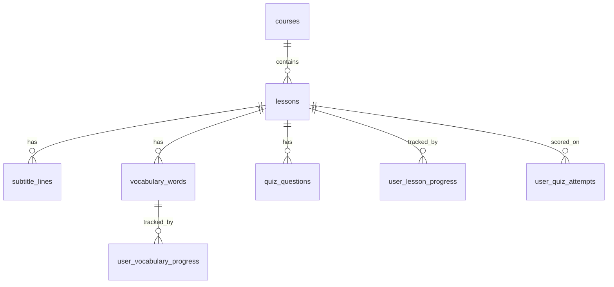

# Database schema — Buunduu Surtsgaay

Human-readable overview of the Supabase/PostgreSQL schema defined in [supabase/migrations/001_initial_schema.sql](./supabase/migrations/001_initial_schema.sql).

The app still reads local TypeScript content; these tables are **planned** for Phase 3+ integration.

---

## Overview

**Content** flows: `courses` → `lessons` → subtitles, vocabulary, quiz rows.  
**Progress** flows: per `user_id` (linked to Supabase Auth in Phase 4) into the three `user_*` tables.

---

## Content tables

### `courses`

**Purpose:** Top-level learning products (e.g. HSK5 Short Drama Chinese).

| Column | Role |
|--------|------|
| `id` | Stable slug (`hsk5`, `hsk4`, …) |
| `title`, `description`, `level` | Catalog display |
| `status` | `available`, `coming_soon`, etc. |
| `order_index` | Sort order on `/courses` |
| `created_at`, `updated_at` | Audit; `updated_at` auto-maintained by trigger |

**Future use:** Replace or mirror `data/courses.ts` for the course list and course detail headers.

---

### `lessons`

**Purpose:** One watchable unit inside a course (Lesson 1, 2, 3, …).

| Column | Role |
|--------|------|
| `id` | Text id matching routes (`'1'`, `'2'`, `'3'`) |
| `course_id` | FK → `courses.id` |
| `title`, `chinese_title`, `subtitle`, `description` | Lesson detail page |
| `duration` | Display string (e.g. `8 min`) |
| `vocabulary_count`, `quiz_count` | Summary counts (should match child rows) |
| `status` | `available` / `locked` for course list |
| `order_index` | Order within course |

**Relationships:** Parent of `subtitle_lines`, `vocabulary_words`, `quiz_questions`, and user progress rows.

**Future use:** Back `getLessonById` / `getLessonsByCourseId` from Supabase instead of `content/courses/.../lesson-*.ts`.

---

### `subtitle_lines`

**Purpose:** Timed subtitles for the watch page (`timedSubtitles` in local content).

| Column | Role |
|--------|------|
| `lesson_id` | FK → `lessons.id` |
| `start_time`, `end_time` | `HH:MM:SS` strings (same as app today) |
| `chinese`, `pinyin`, `mongolian` | Subtitle text and modes |
| `order_index` | Playback order |

**Future use:** Watch page loads lines ordered by `order_index`; subtitle mode toggles stay in the UI.

---

### `vocabulary_words`

**Purpose:** Words for the vocabulary page and HSK filters.

| Column | Role |
|--------|------|
| `lesson_id` | FK → `lessons.id` |
| `chinese`, `pinyin`, `mongolian` | Word card |
| `hsk_level` | Filter (`HSK3`, `HSK4`, `HSK5`) — indexed |
| `example_chinese`, `example_mongolian` | Example sentences |
| `order_index` | List order |

**Future use:** Replace `LessonContent.vocabulary[]`; learned state moves to `user_vocabulary_progress`.

---

### `quiz_questions`

**Purpose:** Questions for the interactive quiz page.

| Column | Role |
|--------|------|
| `lesson_id` | FK → `lessons.id` |
| `type` | `multiple_choice` or `cloze` |
| `question` | Prompt text |
| `options` | JSON array of choice strings |
| `correct_answer` | Expected answer string |
| `explanation` | Shown after submit |
| `order_index` | Question sequence |

**Future use:** Replace `LessonContent.quizQuestions[]`; attempts stored in `user_quiz_attempts`.

---

## Progress tables

These tables are empty until authentication exists. `user_id` is `uuid` without a foreign key yet; **Phase 4** will reference `auth.users(id)` and enable RLS.

### `user_lesson_progress`

**Purpose:** Overall progress on a lesson (started, percent complete, completed).

| Column | Role |
|--------|------|
| `user_id`, `lesson_id` | Unique pair |
| `status` | e.g. `not_started`, `in_progress`, `completed` |
| `progress_percent` | 0–100 |
| `completed_at` | When finished |

**Future use:** Lesson detail progress card; survives refresh for logged-in users.

---

### `user_vocabulary_progress`

**Purpose:** Which words a user marked as learned.

| Column | Role |
|--------|------|
| `user_id`, `vocabulary_word_id` | Unique pair |
| `status` | e.g. `learning`, `learned` |
| `learned_at` | Timestamp when marked learned |

**Future use:** Replace client-only “mark learned” state on the vocabulary page.

---

### `user_quiz_attempts`

**Purpose:** History of quiz runs per lesson.

| Column | Role |
|--------|------|
| `user_id`, `lesson_id` | Who took which lesson quiz |
| `score`, `total`, `percentage` | Result summary |
| `answers` | JSON map of question keys → user answers (shape TBD in app integration) |
| `created_at` | Attempt time |

**Future use:** Result screen and profile stats; optional retry analytics.

---

## Indexes and triggers

**Indexes** speed up common queries: lessons by course, children by lesson + order, vocabulary by HSK level, progress by user.

**Triggers** on `courses`, `lessons`, `user_lesson_progress`, and `user_vocabulary_progress` call `update_updated_at_column()` so `updated_at` stays current on edit.

---

## Security (migration 001)

Row Level Security is **not** enabled in [001_initial_schema.sql](./supabase/migrations/001_initial_schema.sql). Policies are planned separately in [supabase/policies/001_auth_rls_policies.sql](./supabase/policies/001_auth_rls_policies.sql).

---

## Phase 4 Auth and RLS plan

**Goal:** Signed-in users persist progress in Supabase; lesson content stays publicly readable.

### Content tables — public read-only

| Table | Client access |
|-------|----------------|
| `courses` | `SELECT` for `anon` and `authenticated` |
| `lessons` | `SELECT` for everyone |
| `subtitle_lines` | `SELECT` for everyone |
| `vocabulary_words` | `SELECT` for everyone |
| `quiz_questions` | `SELECT` for everyone |

No `INSERT` / `UPDATE` / `DELETE` policies for clients. Content changes stay in SQL seeds / admin tools.

The app continues to use the anon key for Supabase-first **read-only** content ([lib/supabase/content.ts](./lib/supabase/content.ts)).

### Progress tables — private per `user_id`

| Table | Policies (authenticated only) |
|-------|-------------------------------|
| `user_lesson_progress` | `SELECT` / `INSERT` / `UPDATE` / `DELETE` where `auth.uid() = user_id` |
| `user_vocabulary_progress` | `SELECT` / `INSERT` / `UPDATE` / `DELETE` where `auth.uid() = user_id` |
| `user_quiz_attempts` | `SELECT` / `INSERT` only (immutable attempt log) |

`auth.uid()` comes from the Supabase JWT after login. RLS blocks reading or writing another user's rows even if `user_id` is guessed.

### Schema follow-up (Step 2, not Step 1)

- `user_id` is `uuid` today without FK to `auth.users(id)`.
- Phase 4 Step 2 may add `references auth.users(id) on delete cascade` and `not null` after auth testing.

### localStorage during Phase 4 rollout

Until Steps 3–6 ship, [lib/progress.ts](./lib/progress.ts) remains the only progress store. Do not run RLS SQL until auth UI and writes are ready to test (see [supabase/policies/README.md](./supabase/policies/README.md)).

Full narrative: [AUTH_PLAN.md](./AUTH_PLAN.md).

---

## Related docs

- [supabase/README.md](./supabase/README.md) — how to run the migration
- [supabase/policies/README.md](./supabase/policies/README.md) — RLS policy files
- [AUTH_PLAN.md](./AUTH_PLAN.md) — Phase 4 auth roadmap
- [supabase/SEED_PLAN.md](./supabase/SEED_PLAN.md) — seeding Lessons 1–3
- [DEVELOPMENT_PLAN.md](./DEVELOPMENT_PLAN.md) — Phase 3–4 timeline
